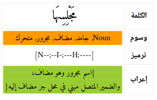
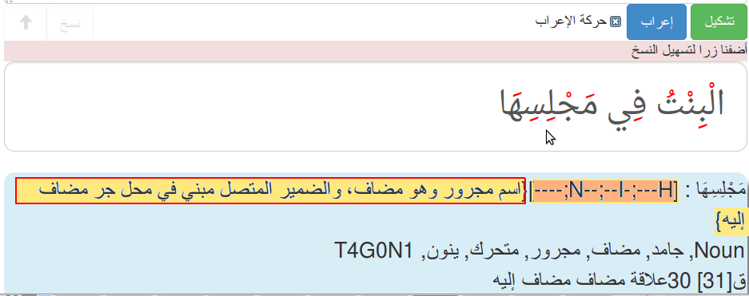

# Mysam: Arabic tags manager, ميسم: إدارة الوسوم  العربية
<div dir="rtl">
تسيير وسوم الكلمات العربية في مجال المعالجة الآلية للغة،  ترميز وتفكيك
هذه المكتبة توفر سكريبت خاصا بترميز وسوم الكلمات (الخصائص الصرفية والنحوية والدلالية) في عبارة وسم مختصرة على شكل سلسلة حروف قصيرة مرمّزة نسميها سلسلة الوسوم.
يمكن التحويل بين قائمة الوسوم وسلسة الوسوم المختصرة
يمكن الاستفادة من هذه المكتبة من أجل ترميز الوسوم وفك ترميزها، سنستعملها في :


 *  التحليل الصرفي ([مكتبة قلصادي](https://github.com/linuxscout/qalsadi) )
 * التحليل النحوي ( [مكتبة ثعلب](https://github.com/linuxscout/thaalab-aranasyn) )
 * التشكيل ( برنامج مشكال[برنامج مشكال](https://github.com/linuxscout/mishkal) [ برنامج مشكال](http://tahadz.com/mishkal) )
 * التدقيق اللغوي النحوي (LanguageTool).

كما تقدّم خدمة متميزة في  **الإعراب بالطريقة القديمة **



* قائمة الوسوم :
    Noun, جامد, مضاف, مجرور, متحرك, ينون
* سلسلة الوسوم المختصرة
    [N--;--I-;---H;----]
* جملة الإعراب
{اسم مجرور وهو مضاف، والضمير المتصل مبني في محل جر مضاف إليه}

** هذه ليست مكتبة للتوسيم، بل لإدارة الوسوم في معالجة اللغة**

</div>
Manage arabic words tags, encode, decode
This library provides a script to encode POS tags (Words features : morphology, syntax, semantic), as a brief tag string  called tag string.
We can convert between tag list <==> coded tag string.
We plan to use it in:

 * Morphology analysis  ([Qalsadi library](https://github.com/linuxscout/qalsadi) )
 *  Syntactic analysis  ( [Thaalab Library](https://github.com/linuxscout/thaalab-aranasyn) )
 * Tashkeel ( [Mishkal](https://github.com/linuxscout/mishkal) [Mishkal-site](http://tahadz.com/mishkal) )
 * LanguageTool - Style and Grammar Checker [LanguageTool](https://languagetool.org/).

It provides a special feature, make **traditional Inflection**.

The conversion can be do like:

 * Tags list:
    Noun, جامد, مضاف, مجرور, متحرك, ينون
 * Encoded tag string
    [N--;--I-;---H;----]
 * Inflection phrase
{اسم مجرور وهو مضاف، والضمير المتصل مبني في محل جر مضاف إليه}

** This not a Tagger library, but, a tags mangger for NLP **


### Tagging System description
You can look at tagging descripton on [docs/tagset.md](docs/tagset.md)

  Developpers:  Taha Zerrouki: http://tahadz.com
    taha dot zerrouki at gmail dot com


 

Features |   value
------------|-----------
Authors  | Taha Zerrouki: http://tahadz.com,  taha dot zerrouki at gmail dot com
Release  |  
License  |[GPL](https://github.com/linuxscout/mysam-tagmanager/master/LICENSE)
Tracker  |[linuxscout/mysam-tagmanager/Issues](https://github.com/linuxscout/mysam-tagmanager/issues)
Website  |[https://pypi.org/project/mysam-tagmanager/](https://pypi.org/project/mysam-tagmanager/)
Source  |[Github](http://github.com/linuxscout/mysam-tagmanager)
Feedbacks  |[Comments](https://github.com/linuxscout/mysam-tagmanager/issues)
Accounts  |[@Twitter](https://twitter.com/linuxscout)


## Citation
If you would cite it in academic work, can you use this citation
```
T. Zerrouki‏, mysam-tagmanager,  Arabic Word Tagger,
  https://pypi.org/projects/mysam-tagmanager/, 2018
```
or in bibtex format

```bibtex
@misc{zerrouki2018mysam,
  title={mysam-tagmanager : Arabic Word Tagger},
  author={Zerrouki, Taha},
  url={https://pypi.org/projects/mysam-tagmanager,
  year={2018}
}
```


## مزايا
* ترميز المزايا إلى وسم موحد مختصر
* تفكيك الوسم إلى خصائصه
* توليد الإعراب حسب الطريق التقليدية

## Features
* Encode features to an unified tag string
* Encode unified tag string to a list of features
* Generate a traditional inflection style

## Applications
* Inflection إعراب
* Grammar analysis.
* Morphological analysis.

## تطبيقات 
* الإعراب
* التحليل النحوي.
* التحليل الصرفي.


## Demo جرّب

يمكن التجربة على [موقع مشكال](http://tahadz.com/mishkal)
، اختر تشكيل، ثم مرّر الفأرة على الكلمة لرؤية التلميح

You can test it on [Mishkal Site](http://tahadz.com/mishkal), choose: Tashkeel, and move mouse over word to get hint.



Installation
=====
```python
pip install mysam-tagmanager
```
## Usage

```python
from mysam import tagcoder
```
## Example

### Test load configuration

```python
import pandas as pd

import mysam.tagconfig as tagconfig
import mysam.tag_const as tag_const

configuer = tagconfig.tagConfig()
configuer.load_config()
# display
df = pd.DataFrame(configuer.tagsdict)
print('****tagdict ****')
print(df)
*****Result *****
****tagdict ****
                 اسم        Noun         فعل        Verb        أداة  ...  1st person       مخاطب  2nd person        غائب  3rd person
part               1           1           1           1           1  ...           4           4           4           4           4
pos                1           1           1           1           1  ...           4           4           4           4           4
attr       word_type   word_type   word_type   word_type   word_type  ...      person      person      person      person      person
ar_attr   نوع الكلمة  نوع الكلمة  نوع الكلمة  نوع الكلمة  نوع الكلمة  ...         شخص         شخص         شخص         شخص         شخص
code               n           n           V           V           T  ...           I           Y           Y           H           H
value           Noun        Noun        Verb        Verb        Tool  ...  1st person  2nd person  2nd person  3rd person  3rd person
ar_value         اسم         اسم         فعل         فعل        أداة  ...       متكلم       مخاطب       مخاطب        غائب        غائب
inflect          اسم         اسم         فعل         فعل         حرف  ...                                                            

[8 rows x 95 columns]
....
....

```
You can load a specific config file by passing parameter to load_conf.
If the file doesn't exist or failed to be open, the default config is loaded.

```python
configuer = tagconfig.tagConfig()
configuer.load_config("tag.config")

```
If you want to know if the input file is opened, fix 'debug' parameter to 'True'


If you want to know if the input file is open, fix 'debug' parameter to 'True'
```python
configuer = tagconfig.tagConfig()
configuer.load_config("tag.config", debug=True)
```

### Test call tagCoder

```python
import mysam.tagcoder
# given tags as list    
taglists = [[u'اسم', u'هاء', u'مجرور',],
        u'تعريف::مرفوع:متحرك:ينون:::'.split(":"),
        ]
tgcoder = mysam.tagcoder.tagCoder()
for taglist in taglists:
    # encode
    tagcode = tgcoder.encode(taglist)
    print("tags list:", u";".join(taglist))
    print("tagcode:", tagcode)
    # decode a tag code string into (key, values)
    print("decode:", tgcoder.decode(tagcode))

**** result ****
tags list: اسم;هاء;مجرور
tagcode: N--;------I;---
decode: [('نوع الكلمة', 'اسم'), ('خاصية', 'لاشيء'), ('جنس', 'لاشيء'), ('عدد', 'لاشيء'), ('شخص', 'لاشيء'), ('علامة', 'لاشيء'), ('زمن', 'لاشيء'), ('بناء', 'لاشيء'), ('إعراب', 'مجرور'), ('عطف', 'لاشيء'), ('استقبال', 'لاشيء'), ('ضمير متصل', 'لاشيء')]
tags list: تعريف;;مرفوع;متحرك;ينون;;;
tagcode: ---;------U;--L
decode: [('نوع الكلمة', 'لاشيء'), ('خاصية', 'لاشيء'), ('جنس', 'لاشيء'), ('عدد', 'لاشيء'), ('شخص', 'لاشيء'), ('علامة', 'لاشيء'), ('زمن', 'لاشيء'), ('بناء', 'لاشيء'), ('إعراب', 'مرفوع'), ('عطف', 'لاشيء'), ('استقبال', 'لاشيء'), ('تعريف', 'معرفة')]
    
```


### Exmaple for inflect
```python 
import mysam.taginflector
tag_inlfector = mysam.taginflector.tagInflector()
word = "يَسْتَعْمِلُونَهَا"
tagcode = 'V-1;M3H-faU;W-H'
print(tag_inlfector.inflect(tagcode))
**** result ****
فعل مضارع   مرفوع وعلامة رفعه ثبوت النون لأنه من الأفعال الخمسة  والواو: ضمير متصل مبني في محل رفع فاعل والضمير المتصل مبني في محل نصب مفعول به
```

### Exmaple for add tag

Add a new tag to existing tags string code

```python
import mysam.tagcoder
tag_coder = mysam.tagcoder.tagCoder()
tagcode = 'V-0;M1H-faU;W--'
tag = "ضمير متصل"
print(tag_coder.add_tag(tag, tagcode))
**** result ****
V-0;M1H-faU;W-H
```

### Exmaple for remove tag

Remove and  a tag from existing tags string code

```python
import mysam.tagcoder
tag_coder = mysam.tagcoder.tagCoder()
tagcode = 'V-0;M1H-faU;W-H'
tag = "ضمير متصل"
print(tag_coder.remove_tag(tag, tagcode))
**** result ****
V-0;M1H-faU;W--
```

### 

### Exmaple for has tag

```python 
import mysam.tagcoder
tag_coder = mysam.tagcoder.tagCoder()
tags = ['اسم', 'مجرور', 'مذكر', "مفرد", "واو"]
tagcode = tag_coder.encode(tags)
print(tagcode)
tag_search = u"مجرور"
print(tag_coder.has_tag(tag_search, tagcode))
tag_search = u"فعل"
print(tag_coder.has_tag(tag_search, tagcode))
**** result ****
N--;M1----I;---
True
False
```


